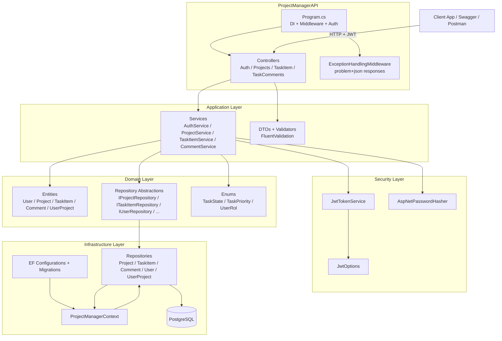

# Project Manager Backend

A real-world project to reinforce knowledge in software development, architectures, and clean architecture, also integrating the use of AI through MCP servers and tools like OpenCode to adapt to the new development paradigm with AI.
Also looking to delve a little deeper into DevOps and application deployment

A backend API built with .NET 8 and ASP.NET Core for managing projects and tasks.
The solution follows Clean Architecture (monolith) with clear layer separation (Domain, Application, Infrastructure, API) and SOLID principles.

> Last Changes: 2026-04

## Features

- **Project Management**: Create, list, update, and delete projects.
- **Task Tracking**: Manage tasks (state + priority) inside a project.
- **Task Comments**: List and create comments associated to a task inside a project.
- **Authentication**: JWT Bearer authentication (Swagger supports Bearer tokens).
- **Database**: Entity Framework Core + PostgreSQL.
- **Error Handling**: Custom exception middleware for consistent API responses.

- Implemented task comments endpoints (list + create) under project tasks.
- Added comment DTOs, service layer, repository interface, and EF Core repository implementation.
- Enforced authorization for comments and tasks: **project owner or project member**.

## Tech Stack

- **Framework**: .NET 8
- **Web**: ASP.NET Core
- **ORM**: Entity Framework Core
- **Database**: PostgreSQL
- **Docs**: Swagger / OpenAPI

## Quickstart

### Prerequisites

- [.NET 8 SDK](https://dotnet.microsoft.com/en-us/download/dotnet/8.0)
- [PostgreSQL](https://www.postgresql.org/download/) (12+)

### Setup

1. Restore packages:
   ```bash
   dotnet restore ProjectManagerAPI.sln
   ```

2. Configure settings (local):
   - Connection string: `ConnectionStrings:DefaultConnection`
   - JWT settings: `Jwt:Issuer`, `Jwt:Audience`, `Jwt:SecretKey`, `Jwt:AccessTokenExpirationMinutes`

   See `src/ProjectManagerAPI/appsettings.json` for the default shape.
   **Do not use real credentials or secrets in source control**.

3. Apply migrations:
   ```bash
   dotnet ef database update --project src/Infrastructure --startup-project src/ProjectManagerAPI
   ```

4. Run the API:
   ```bash
   dotnet run --project src/ProjectManagerAPI
   ```

5. Open Swagger (Development): `https://localhost:5001/swagger`

## Authentication

- `POST /api/auth/register` - Register and receive an access token.
- `POST /api/auth/login` - Login and receive an access token.

Most endpoints require `Authorization: Bearer {token}`.

## API Endpoints

- **Projects**
  - `GET /api/projects`
  - `POST /api/projects`
  - `PUT /api/projects/{id}`
  - `DELETE /api/projects/{id}`

- **Tasks**
  - `GET /api/projects/{projectId}/tasks`
  - `GET /api/projects/{projectId}/tasks/{taskItemId}`
  - `POST /api/projects/{projectId}/tasks`
  - `PUT /api/projects/{projectId}/tasks/{taskItemId}`
  - `DELETE /api/projects/{projectId}/tasks/{taskItemId}`

- **Task Comments**
  - `GET /api/projects/{projectId}/tasks/{taskItemId}/comments`
  - `POST /api/projects/{projectId}/tasks/{taskItemId}/comments`

## Authorization Model

- The API derives the acting user id from the JWT `NameIdentifier` claim.
- For project-scoped resources (tasks and task comments), access is restricted to:
  - the project owner, or
  - a user with an active membership in the project.

## Configuration Notes

- **Database**: `ConnectionStrings:DefaultConnection`
- **JWT**: `Jwt:*` settings in `src/ProjectManagerAPI/appsettings.json`
- **CORS**: Not configured yet (see roadmap).

## Project Structure

```
src/
├── Domain/                 # Entities, enums, and repository abstractions
├── Application/            # DTOs, services, use-case logic, exceptions
├── Infrastructure/         # EF Core DbContext, configurations, repositories, migrations
└── ProjectManagerAPI/      # ASP.NET Core Web API (controllers, Program.cs)
```

## System Diagram (Current)



## Development

- Restore: `dotnet restore ProjectManagerAPI.sln`
- Build: `dotnet build ProjectManagerAPI.sln`
- Run: `dotnet run --project src/ProjectManagerAPI`
- Migrations:
  - Add: `dotnet ef migrations add <Name> --project src/Infrastructure --startup-project src/ProjectManagerAPI`
  - Update: `dotnet ef database update --project src/Infrastructure --startup-project src/ProjectManagerAPI`

## Roadmap / Next Implementations

- **Historial / Audit Log**: Add a history entity to register user actions within a project (who/what/when).
- **Frontend**: Implement a frontend client (auth, projects, tasks, comments).
- **CORS + HTTPS**: Add CORS policies for frontend origins and ensure correct local/prod HTTPS behavior.
- **FastAPI microservice**: In the future, I want to create a small microservice to implement AI (like a chatbot or something similar) in this project using Python FastAPI to practice microservices architecture.
- **Tests**: Unit test, integration test, deep learning and study about test using xUnit, moq and more test tools
- **Docker**: Prepare container to deploy the backend to live production.
- **Render**: Backend deploy platform.

## Development Tools and Automation

- Skills live under `.agents/skills/` (e.g., .NET best practices, design pattern review, README guidance).
- PR generation and revitions via Github MCP server
- Apply direct guide and learning of the Microsoft Learn MCP server
- CI/CD via GitHub Actions: `.github/workflows/dotnet.yml`.

## Contributing

If you are interested in creating new modules for this small project, you are welcome to contribute!

1. Fork the repository.
2. Create a feature branch (`git checkout -b feature/YourFeature`).
3. Commit your changes (`git commit -am 'Add some feature'`).
4. Push to the branch dev (`git push origin feature/YourFeature`).
5. Create a Pull Request.

## Acknowledgments

- Built following Clean Architecture principles.
- Automation in AI systems and study methods using MCP servers to improve study methods and knowledge