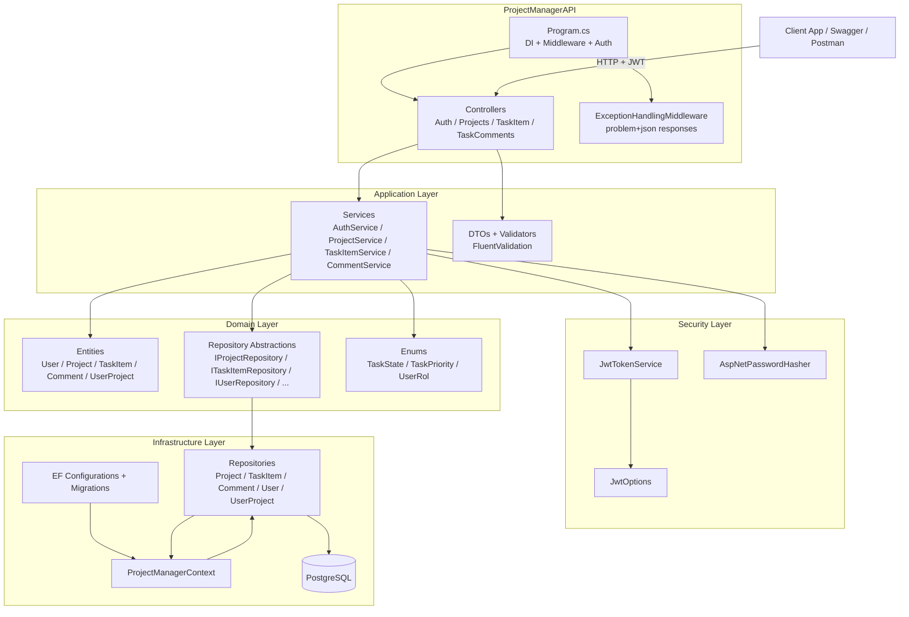

# Project Manager Backend

## 🚀 Project Overview

A backend API built with .NET 8 and ASP.NET Core that simulates a real-world project management system (similar to tools like Trello or Jira).

This project focuses on designing a scalable and maintainable architecture using Clean Architecture principles, while also exploring how AI tools can enhance the software development workflow.

## Tech Stack

- **Framework**: .NET 8
- **Web**: ASP.NET Core
- **ORM**: Entity Framework Core
- **Database**: PostgreSQL
- **Docs**: Swagger / OpenAPI


## Core Features

### 🔐 Authentication & Authorization
- JWT-based authentication
- Role-based access control

### 📁 Project Management
- Create, update, delete projects
- Shared projects between users

### ✅ Task Management
- Assign tasks to users
- Task states and priorities

### 💬 Comments System
- Add and retrieve comments on tasks
- Access restricted to project members

## Recent Updates

- Implemented task comments endpoints (list + create) under project tasks.
- Added comment DTOs, service layer, repository interface, and EF Core repository implementation.
- Enforced authorization for comments and tasks: **project owner or project member**.
- Added task comment update and delete endpoints.
- Comment permissions:
  - Edit comment: only the comment author.
  - Delete comment: only the comment author with **Admin** role in the project.
- Implemented CORS into API to recive Frontend local port

## 🤖 AI-Assisted Development

This project was developed using AI as an active part of the workflow, not just as a helper.

Tools and approaches used:
- Microsoft Learn MCP Server
- GitHub MCP Server (PR automation)
- OpenCode environment experimentation

Focus:
- Faster iteration
- Better understanding of concepts
- Guided learning and architecture decisions

## Quickstart

### Prerequisites

- [.NET 8 SDK](https://dotnet.microsoft.com/en-us/download/dotnet/8.0)
- [PostgreSQL](https://www.postgresql.org/download/) (12+)

### Setup

1. Restore packages:
   ```bash
   dotnet restore ProjectManagerAPI.sln
   ```

2. Configure settings (local):
   - Connection string: `ConnectionStrings:DefaultConnection`
   - JWT settings: `Jwt:Issuer`, `Jwt:Audience`, `Jwt:SecretKey`, `Jwt:AccessTokenExpirationMinutes`

   See `src/ProjectManagerAPI/appsettings.json` for the default shape.
   **Do not use real credentials or secrets in source control**.

3. Apply migrations:
   ```bash
   dotnet ef database update --project src/Infrastructure --startup-project src/ProjectManagerAPI
   ```

4. Run the API:
   ```bash
   dotnet run --project src/ProjectManagerAPI
   ```

5. Open Swagger (Development): `https://localhost:5001/swagger`

## Authentication

- `POST /api/auth/register` - Register and receive an access token.
- `POST /api/auth/login` - Login and receive an access token.

Most endpoints require `Authorization: Bearer {token}`.

## API Endpoints

- **Projects**
  - `GET /api/projects`
  - `POST /api/projects`
  - `PUT /api/projects/{id}`
  - `DELETE /api/projects/{id}`

- **Tasks**
  - `GET /api/projects/{projectId}/tasks`
  - `GET /api/projects/{projectId}/tasks/{taskItemId}`
  - `POST /api/projects/{projectId}/tasks`
  - `PUT /api/projects/{projectId}/tasks/{taskItemId}`
  - `DELETE /api/projects/{projectId}/tasks/{taskItemId}`

- **Task Comments**
  - `GET /api/projects/{projectId}/tasks/{taskItemId}/comments`
  - `POST /api/projects/{projectId}/tasks/{taskItemId}/comments`
  - `PUT /api/projects/{projectId}/tasks/{taskItemId}/comments/{commentId}`
  - `DELETE /api/projects/{projectId}/tasks/{taskItemId}/comments/{commentId}`

## Authorization Model

- The API derives the acting user id from the JWT `NameIdentifier` claim.
- For project-scoped resources (tasks and task comments), access is restricted to:
  - the project owner, or
  - a user with an active membership in the project.
- Task comments extra rules:
  - Update requires the acting user to be the comment author.
  - Delete requires the acting user to be both:
    - the comment author, and
    - project member with role `Admin`.

## Configuration Notes

- **Database**: `ConnectionStrings:DefaultConnection`
- **JWT**: `Jwt:*` settings in `src/ProjectManagerAPI/appsettings.json`
- **CORS**: Not configured yet (see roadmap).

## 🏗️ Project Structure
The project follows a Clean Architecture approach with clear separation of concerns between layers:

```
src/
├── Domain/                 # Entities, enums, and repository abstractions
├── Application/            # DTOs, services, use-case logic, exceptions
├── Infrastructure/         # EF Core DbContext, configurations, repositories, migrations
└── ProjectManagerAPI/      # ASP.NET Core Web API (controllers, Program.cs)
```

## System Diagram (Current)



## Development

- Restore: `dotnet restore ProjectManagerAPI.sln`
- Build: `dotnet build ProjectManagerAPI.sln`
- Run: `dotnet run --project src/ProjectManagerAPI`
- Migrations:
  - Add: `dotnet ef migrations add <Name> --project src/Infrastructure --startup-project src/ProjectManagerAPI`
  - Update: `dotnet ef database update --project src/Infrastructure --startup-project src/ProjectManagerAPI`

## Roadmap / Next Implementations

- **Historial / Audit Log**: Add a history entity to register user actions within a project (who/what/when).
- **Frontend**: Implement a frontend client (auth, projects, tasks, comments).
- **CORS + HTTPS**: Add CORS policies for frontend origins and ensure correct local/prod HTTPS behavior.
- **FastAPI microservice**: In the future, I want to create a small microservice to implement AI (like a chatbot or something similar) in this project using Python FastAPI to practice microservices architecture.
- **Docker**: Prepare container to deploy the backend to live production.
- **Render**: Backend deploy platform.

## 🧪 Testing 

Implemented unit tests for each service and controller in this proyect

- Unit testing with xUnit using AAA (Arrange, Act, Assert) pattern 
- Mocking with Moq

Next implementation is add integration tests

## 🧠 Key Learnings

- Applying Clean Architecture in a real-world backend project
- Designing authorization logic for shared resources
- Structuring scalable APIs with service and repository layers
- Integrating AI tools into the development workflow
- Improving problem-solving and iteration speed using AI

## 🎯 Purpose of the Project

This project was built to move beyond simple CRUD applications and simulate a real-world backend system with proper architecture, authorization rules, and scalability in mind.

It also serves as a playground to experiment with AI-assisted development workflows.

## Contributing

If you are interested in creating new modules for this small project, you are welcome to contribute!

1. Fork the repository.
2. Create a feature branch (`git checkout -b feature/YourFeature`).
3. Commit your changes (`git commit -am 'Add some feature'`).
4. Push to the branch dev (`git push origin feature/YourFeature`).
5. Create a Pull Request.
